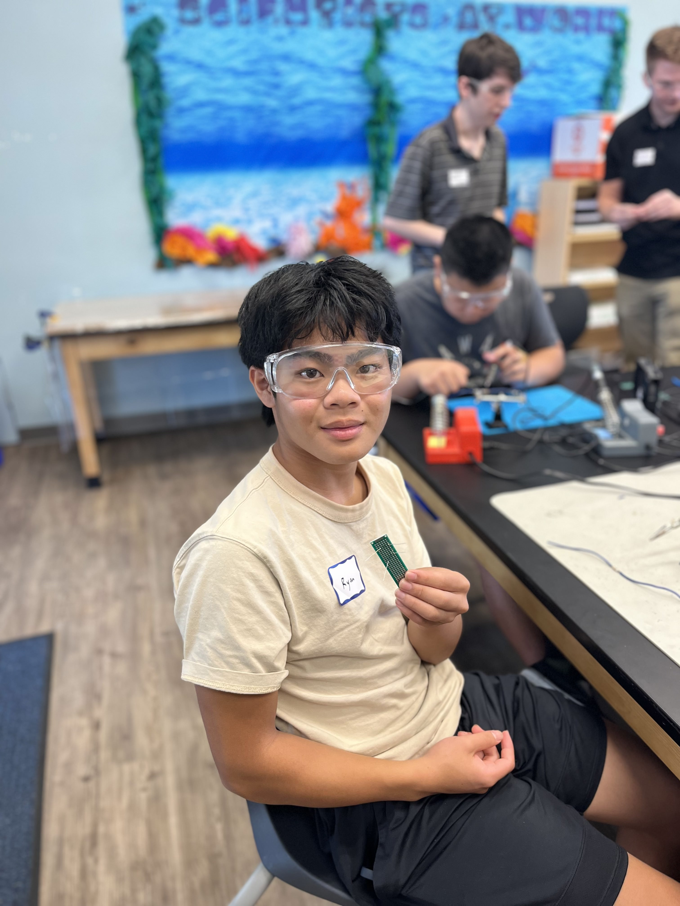
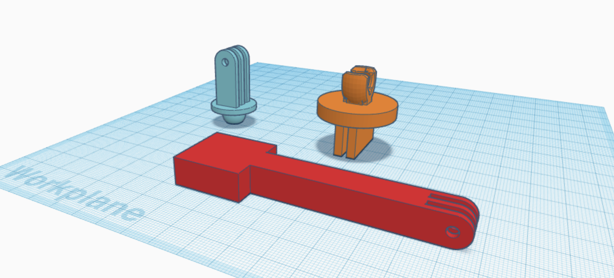
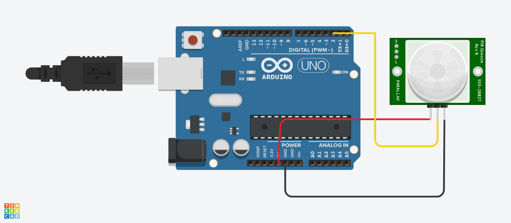

# Smile Detection Project
Smile Recognition with Python is a program that uses the OpenCV computer vision library to detect faces that are smiling or not smiling by turning the frames of the video feed into monochrome, to compare against the haarcascade models of data to produce an output which is displayed with text and rectangles highlighting the person. This utilizes a Raspberry Pi as the computing power to calculate the program and produce its return. 

| **Engineer** | **School** | **Area of Interest** | **Grade** |
|:--:|:--:|:--:|:--:|
| Ryan D | Wilcox High School | Computer Science | Incoming Junior |



# Fourth Milestone (Modification)

<iframe width="560" height="315" src="https://www.youtube.com/embed/S2oVig7070k?si=oiiIeNdoWCHKKNWS" title="YouTube video player" frameborder="0" allow="accelerometer; autoplay; clipboard-write; encrypted-media; gyroscope; picture-in-picture; web-share" allowfullscreen></iframe>

## Summary
  During this final milestone, the essence of my modification was to create a program that would automatically take photos of the user smiling, and then upload it to a cloud server so the user could access it later. Though I ran through some small trouble, I was able to get the Google Drive API to work with my code so that I could upload the photos taken to the Google Drive folder. I made sure that the program was configurable so that the user would be able to turn on or off the automatic capture feature and change the delay between photos. I utilized both the Google Cloud along with a service account to be able to upload my images to the Google Drive Folder. Additionally, I custom CAD'ed a Raspberry Pi Cover for my case so that the Pi Camera could fit inside looking aesthetic and not in the way with its cable out. 

## Challenges
### First Challenge
  The main challenges of this milestone were first, being able to get the proper measurements of the Pi Camera and the Raspberry Pi Case so that I could CAD a cover for it that would fit and work well. After around 5 tries of testing different values since my measurements seemed to be off, I was able to get a design that would work well and look nice. This did take quite the time to do though, since each print took around 3 hours to fully print out. Therefore I had to wait around 21 hours in total since I printed out the final version twice more for minor adjustments. 

### Second Challenge
  The second major challenge was the more difficult and tedious one, which would be the addition of the automatic capture feature with the pictures taken uploaded to a cloud server for the user to view later on. Due to my lack of experience in the area, it was difficult to figure out the steps needed to set up the program. In addition, I needed to pick out one service to use out of the many out there, without any knowledge of which one was suited for my needs. After I chose to use Google Drive as my hosting service, I had to figure out how to use it. By going through many tutorials and trying to debug my code, I was able to get it to work with a Google Cloud service account, which uploaded the photos through my code to the folder. However, the code I wrote was only to upload images, not the full script which would take the photos as well. Therefore I had to integrate my original code of identifying smiles, but slightly modified it into the code I just wrote which would complete the automatic function of the program. With a few bug fixes I was able to get it up and running but it wasn't the most efficient. After I cleaned it up a little so that it would work well to some degree.

## Next Step
  My next step is to clean and modify my code so that no unnecessary chunks are present to make sure that my code is running efficiently and fast enough for my slow Raspberry Pi processor to compute. Overall, my project is finished and I am quite proud of the well-working device that I made myself. 

## Takeaways
I enjoyed the experience of this camp. For me, this was something new and unexpected, as I had never done anything with engineering before. Learning how to use an Arduino and Raspberry Pi for the first time was difficult, but quite worth the journey. I feel that I have learned a lot from this camp, and not just about technical abilities like how to build and set up hardware. Writing in my portfolio, and daily notebooks, and talking to my classmates taught me how to voice myself and more importantly how to document my thoughts. I will admit, at first I thought most of the instructors were pretty much useless, as I could figure out most problems by myself and they usually did not know the exact answer as well. However, later on, I realized that they were a lot more helpful than I originally thought, helping me out with problem-solving some issues that were incredibly difficult to complete. They were also very good company and helped make the camp a more enjoyable experience, even when I was facing issues. I definitely will pursue more engineering projects and ideas in the future because of this camp. So I want to say thanks to all the instructors for not only aiding me but making my time here at the camp feel golden, the camp director for helping me figure situations out when I was stuck, and my classmates who livened the experience through my countless interactions with them. 

## Code for Fourth Milestone
```python
import cv2
import time
from picamera2 import Picamera2
from google.oauth2 import service_account
from googleapiclient.discovery import build
from googleapiclient.http import MediaFileUpload
from googleapiclient.errors import HttpError
import os

face_cascade = cv2.CascadeClassifier(cv2.data.haarcascades + 'haarcascade_frontalface_default.xml')
smile_cascade = cv2.CascadeClassifier(cv2.data.haarcascades + 'haarcascade_smile.xml')

picam2 = Picamera2()
picam2.configure(picam2.create_preview_configuration(main={"format": 'XRGB8888', "size": (640, 480)}))
picam2.start()

automaticCapture = False
delay = 2
imgCount = 1

while True:
   userInput = input("\n\033[1mWould you like to automatically take photos when smiling? Input y/n\033[0m\n").lower()
   if userInput == "y":
       automaticCapture = True
       print("\033[1mAutomatic capture is turned on. Press space to turn on/off\033[0m\n")
       break
   elif userInput == "n":
       print("\033[1mAutomatic capture is turned off. Press space to turn on/off\033[0m\n")
       break
   else:
       print("\033[1mPlease input only y or n\033[0m\n")

while True:
   if automaticCapture:
       try:
           userInput = input("\n\033[1mWhat would you like the delay of automatic capture to be?\033[0m\n")
           delay = int(userInput)
           print("\033[1mYour delay is set to:\033[0m", str(delay) + "s")
           break
       except ValueError:
           print("\033[1mPlease input only integers.\033[0m\n")
   else:
       break

while True:
   frame = picam2.capture_array()
   gray = cv2.cvtColor(frame, cv2.COLOR_BGR2GRAY)
   faces = face_cascade.detectMultiScale(gray, 1.3, 5)

   for (x, y, w, h) in faces:
       cv2.rectangle(frame, (x, y), (x + w, y + h), (255, 255, 255), 2)
       roi_gray = gray[y:y + h, x:x + w]
       roi_color = frame[y:y + h, x:x + w]
       smiles = smile_cascade.detectMultiScale(roi_gray, 1.8, 20)

       for (sx, sy, sw, sh) in smiles:
           if len(smiles) == 2:
               cv2.putText(frame, "Smiling", (x + 100, y - 30), cv2.FONT_HERSHEY_DUPLEX, 1.25, (0, 255, 0), 1, cv2.LINE_AA)
               cv2.rectangle(roi_color, (sx, sy), (sx + sw, sy + sh), (0, 255, 0), 2)
           else:
               cv2.putText(frame, "Not Smiling", (x + 45, y - 30), cv2.FONT_HERSHEY_DUPLEX, 1.25, (0, 0, 255), 1, cv2.LINE_AA)
               cv2.rectangle(roi_color, (sx, sy), (sx + sw, sy + sh), (0, 0, 255), 2)

   cv2.imshow('Video', frame)

   key = cv2.waitKey(1) & 0xff
   if key == 113:
       break
   elif key == 32:
       automaticCapture = not automaticCapture
       if automaticCapture:
           print("\033[1mAutomatic capture turned on.\033[0m\n")
       else:
           print("\033[1mAutomatic capture turned off.\033[0m\n")

   if automaticCapture:
       for (x, y, w, h) in faces:
           roi_color = frame[y:y + h, x:x + w]
           smiles = smile_cascade.detectMultiScale(gray[y:y + h, x:x + w], 1.8, 20)

           for (sx, sy, sw, sh) in smiles:
               if len(smiles) == 2:
                   cv2.imwrite('images/test_' + str(imgCount) + '.png', picam2.capture_array())
                   imgCount += 1
                   print("\033[1mPicture taken\033[0m")
                   time.sleep(delay)

picam2.stop()
cv2.destroyAllWindows()

credentials_file = '/home/ryan/Documents/test-427616-c0c324496d6c.json'
SCOPES = ['https://www.googleapis.com/auth/drive']

def authenticate():
   credentials = service_account.Credentials.from_service_account_file(credentials_file, scopes=SCOPES)
   drive_service = build('drive', 'v3', credentials=credentials)
   return drive_service

def get_folder_id(drive_service, folder_name):
   page_token = None
   while True:
       response = drive_service.files().list(q=f"name='{folder_name}' and mimeType='application/vnd.google-apps.folder'",
                                             spaces='drive',
                                             fields='nextPageToken, files(id, name)',
                                             pageToken=page_token).execute()
       for file in response.get('files', []):
           return file.get('id')
       page_token = response.get('nextPageToken', None)
       if page_token is None:
           break
   return None

def upload_folder_images(drive_service, folder_path, folder_id=None):
   if not os.path.exists(folder_path) or not os.path.isdir(folder_path):
       print(f'Folder does not exist or is not a valid directory: {folder_path}')
       return

   for filename in os.listdir(folder_path):
       if filename.endswith('.jpg') or filename.endswith('.jpeg') or filename.endswith('.png'):
           image_file = os.path.join(folder_path, filename)
           file_metadata = {'name': filename}
           if folder_id:
               file_metadata['parents'] = [folder_id]

           media = MediaFileUpload(image_file, mimetype='image/jpeg')
           try:
               file = drive_service.files().create(body=file_metadata,
                                                   media_body=media,
                                                   fields='id').execute()
               print(f'Uploaded: {filename} (File ID: {file.get("id")})')

           except HttpError as error:
               print(f'HttpError occurred for {filename}: {error}')
           except Exception as error:
               print(f'An error occurred for {filename}: {error}')

def check_folder_exists(folder_path):
   return os.path.exists(folder_path) and os.path.isdir(folder_path)

if __name__ == '__main__':
   drive_service = authenticate()

   folder_path = '/home/ryan/Documents/images'

   if check_folder_exists(folder_path):
       print(f'Folder exists at: {folder_path}')
   else:
       print(f'Folder does not exist at: {folder_path}')
       exit()

   folder_name = "Images"

   folder_id = get_folder_id(drive_service, folder_name)

   if folder_id:
       upload_folder_images(drive_service, folder_path, folder_id)
       print("\n\033[1mYou can find your photos here: \033[0m" + "https://drive.google.com/drive/folders/17q5UJjXnvVGpk3GxkltS5TnXHEcqeuL2?usp=sharing")
   else:
       print(f'Folder "{folder_name}" not found.')
```

# Third Milestone

<iframe width="560" height="315" src="https://www.youtube.com/embed/zquCfsTlbjA?si=9S-H9eMII4AWTtvV" title="YouTube video player" frameborder="0" allow="accelerometer; autoplay; clipboard-write; encrypted-media; gyroscope; picture-in-picture; web-share" allowfullscreen></iframe>

## Summary
  In my third milestone, I custom CAD'ed a Pi Camera stand using TinkerCAD as well as cleaning up and making sure that my final code is efficient. I made sure that my code looked clean and would run in the shortest amount of time with the least amount of resources wasted. I also spent time ensuring that my camera stand would pair with not only my Raspberry Pi case but additionally the back plate of the Pi Camera which was difficult to fit. 

## Challenges
  One of the challenges I faced during this milestone was achieving the right results with the 3D printer. I wanted to print out a Pi camera stand that would fit the alignment of my Raspberry Pi case, but also the Pi camera dimensions. Even though I correctly measured everything out when I created the 3D model of the stand in the online CAD software TinkerCAD, the 3D printer was never able to perfectly get the dimensions of the parts I needed. Therefore, the process of creating the stand required much trial and error to achieve a reasonable result. At first, I wanted to use screws to mount the Pi camera to the stand, but I realized later that I would never be able to print such exact models with the 3D printers. So, I had to scrap that idea and use adhesives to attach the Pi camera. Though I believe that the process itself was somewhat difficult, the thought process of brainstorming beforehand proved to be a lot more challenging. This was because I wanted the stand to mount very close to the Raspberry Pi case. As a cause of that, I decided to make the stand attachable to the sides of the Raspberry Pi case with two blocks at the bottom of my stand which would squeeze one of the Raspberry Pi case's walls in between to stabilize the mount. 

## Next step
  My next step is to first brainstorm my modification and then fully complete it. Although I have a few ideas on modifications, I most likely will modify my program to automatically capture a photo when the user is detected to be smiling. From there, I may add more modifications that I see fit or one that may add more depth to the alteration. 

## Schematics for the Pi Camera Stand


# Second Milestone

<iframe width="560" height="315" src="https://www.youtube.com/embed/V6mb41Rkjic?si=CWE8ydTZMPsTPr9p" title="YouTube video player" frameborder="0" allow="accelerometer; autoplay; clipboard-write; encrypted-media; gyroscope; picture-in-picture; web-share" allowfullscreen></iframe>

## Summary
  During this milestone, I was able to finish up, modify, and clean up my code. I made the program identify the face, and then identify whether they are smiling or not currently with displayed text as output. I also changed the boxes to match the status in color, so red for not smiling and green for smiling. Though not the most accurate, it works with decent efficiency and returns an acceptable output. However, I had to restart all my progress at some point since my SD card was fried. I installed 64-bit Raspbian (Raspberry Pi OS) this time and installed the software needed along with recording what I lost. After that, I also tried changing the aspect ratio of the output to a larger window, but it would not work since the Raspberry Pi's graphical power could not handle above 480p. 

## Challenges
  One of my most difficult challenges with the program and perhaps the most fatal one is when my Raspberry Pi stopped booting correctly. Somehow, one day my Raspberry Pi stopped working on boot saying the message that it could not open blockdev and was unable to mount root fs on unknown-block. I tried to use fsck but failed to do so, figuring out that my SD card was gone since it somehow had a broken pin.
So after that, I had to restart all my progress in downloading the firmware and software needed along with all my code. Luckily, flashing a new SD and installing Raspbian (Raspberry Pi OS) 64-bit was a lot easier than its 32-bit counterpart. I got all of my things working again almost flawlessly though I had a small trouble with installing OpenCV. It would error with the message that this environment was externally managed and would say that my OpenCV was already installed when it did not show up in ```pip list```. This was solved through some small research though, not taking that long with my eventual discovery of a StackOverflow post with the terminal command ```sudo mv /usr/lib/python3.11/EXTERNALLY-MANAGED /usr/lib/python3.11/EXTERNALLY-MANAGED.old```. After that, it was just figuring out how to make my code more accurate with the only challenge being how configurable the OpenCV library was. 

## Next Step
  My next step is to finalize the improvements in my code to make it more accurate and more efficient if possible with OpenCV configurations. I also plan to CAD and assemble a Pi Camera Stand so that my camera does not need a human hand to hold it anymore. I will most likely first print out prototypes and then finely refine the design to work for my purposes.  

## Code for Second Milestone
```python
# importing the OpenCV library & Picamera libraries
import cv2;
from picamera2 import Picamera2;

# defining the haarcascades and it's file path for the IDE to access it
face_cascade = cv2.CascadeClassifier(cv2.data.haarcascades +'haarcascade_frontalface_default.xml')
smile_cascade = cv2.CascadeClassifier(cv2.data.haarcascades +'haarcascade_smile.xml')

# starting up the Picamera and configuring it
picam2 = Picamera2()                                     
picam2.configure(picam2.create_preview_configuration(main={"format": 'XRGB8888', "size": (640, 480)}))
picam2.start()

#loops the function of comparing the grayscale frames of the live feed to the haarcascade data models and breaks the loop when the user presses the "q" key
while True:
   frame = picam2.capture_array()
   gray = cv2.cvtColor(frame, cv2.COLOR_BGR2GRAY)
   faces = face_cascade.detectMultiScale(gray, 1.3, 5)

   for (x, y, w, h) in faces:
       cv2.rectangle(frame, (x, y), ((x + w), (y + h)), (255, 255, 255), 2)
       roi_gray = gray[y:y + h, x:x + w]
       roi_color = frame[y:y + h, x:x + w]
       smiles = smile_cascade.detectMultiScale(roi_gray, 1.8, 20)

       for (sx, sy, sw, sh) in smiles:
           if len(smiles) == 2:
               cv2.putText(frame, "Smiling", (x + 100, y - 30), cv2.FONT_HERSHEY_DUPLEX, 1.25, (0, 255, 0), 1, cv2.LINE_AA)
               cv2.rectangle(roi_color, (sx, sy), ((sx + sw), (sy + sh)), (0, 255, 0), 2)  # BGR
           else:
               cv2.putText(frame, "Not Smiling", (x + 45, y - 30), cv2.FONT_HERSHEY_DUPLEX, 1.25, (0, 0, 255), 1, cv2.LINE_AA)
               cv2.rectangle(roi_color, (sx, sy), ((sx + sw), (sy + sh)), (0, 0, 255), 2)

   cv2.imshow('Video', frame)

   if cv2.waitKey(1) & 0xff == ord('q'):
       break

# after the loop is broken the program moves on to stopping the Pi Camera and removing the preview window
picam2.stop()
cv2.destroyAllWindows()

# helpful documentations/tutorials:
# https://www.geeksforgeeks.org/python-smile-detection-using-opencv/
# https://github.com/raspberrypi/picamera2/tree/main/examples
```

# First Milestone

<iframe width="560" height="315" src="https://www.youtube.com/embed/1HToM-Ea3wc?si=JWhQp1fXB9ZPbLfZ" title="YouTube video player" frameborder="0" allow="accelerometer; autoplay; clipboard-write; encrypted-media; gyroscope; picture-in-picture; web-share" allowfullscreen></iframe>

## Summary
  For my first milestone, I fully set up my Raspberry Pi, along with the following software I needed to accomplish my project. I started with installing (recording/streaming software) OBS on my Macbook to use as an external monitor for my Raspberry Pi as it did not come with one pre-installed. I then installed Raspbian (Raspberry Pi OS) 32-bit (**BIG tip from the future, in my second milestone, DO NOT install 32-bit Raspbian OS** which comes default flashed onto the SD card since that is where I first messed up + all the guides are on 64-bit OS and everything runs a bit better on it as well) and ran ``` sudo apt update``` and ```sudo apt upgrade```. After that, I installed VSCode using ```sudo apt install code``` and upgraded it with ```sudo apt upgrade code``` and OpenCV, which was the AI recognition library that I needed for my project with much difficulty in the steps explained below. Finally, I fixed my broken camera and started to test some basic pre-written code I made on the side with a couple of tutorials while setting up the Raspberry Pi.

## Challenges
### First Challenge
  To download OpenCV, the AI library that I was going to use, it took many trials and research to get my final result after hours of working. Using the normal command which is ```sudo apt install python3-opencv``` did not work for me since I did not have pipwheel which returned the PEP 517 error, and could not build wheels. After about 9 hours of following different tutorials, waiting, failing, and retrying I figured out that it was not downloading since the OpenCV version I wanted to download was not the version my Raspberry Pi was compatible with. Eventually, I resorted to downloading an older version which worked out fine with the command ```pip install opencv-python==3.4.13.47```. This worked perfectly fine even though it was an older version of OpenCV, so don't be afraid to install older versions of software even if they may lack a few features. 
  
### Second Challenge
  After my OpenCV was downloaded, everything was fine, or so I thought. My Pi camera I figured, was USB and was therefore not compatible with the camera library built into the Raspberry Pi as that required a ribbon cable connection to the motherboard instead of an external USB connector. After I switched it, the camera worked fine. Unfortunately, later on, my Raspberry Pi failed me again, breaking my camera again and showing no camera detected when I tried with ```libcamera-hello --list-cameras```alternatively ```libcamera-hello list-cameras``` and also ```raspistill -o image.jpeg``` for trying to take a picture with the camera. After almost 9 more hours of debugging, I found out that I needed to change my config boot commands. I did this by typing ```sudo nano /boot/config.txt``` (control + x to escape and if you add any changes just press enter after that) and adding ```camera_auto_detect=1``` & ``` display_auto_detect=1``` since I did not have them already for some reason (probably caused by my messing with the raspi-config settings and enabling/disabling legacy camera, so don't do this). After replacing my Pi camera to check for hardware faults and changing many settings for software faults which ended with my edition of the boot config code, I was able to get everything to work. 

## Next step
  My next step would be to edit and modify my code for efficiency and complication as it needed to be added on with other things and cleaned up a bit. I saw a previous example with the green and red text indicating whether someone was smiling or not which I thought was a great idea that I would like to try to implement in my way. Therefore I will also be working on floating text alongside fixing up the efficiency of my program so it will be more precise when it comes to displaying the correct output wanted. If I have time, I may dip into my third milestone which is adding a modification to my project to make it differ from others and to reduce the simplicity. 

## Code for First Milestone
```python
# importing the OpenCV library & Picamera libraries
import cv2;
from picamera2 import Picamera2;

# defining the haarcascades and it's file path for the IDE to access it
face_cascade = cv2.CascadeClassifier(cv2.data.haarcascades +'haarcascade_frontalface_default.xml') 
smile_cascade = cv2.CascadeClassifier(cv2.data.haarcascades +'haarcascade_smile.xml')

# starting up the Picamera and configuring it
picam2 = Picamera2()                                            
picam2.configure(picam2.create_preview_configuration(main={"format": 'XRGB8888', "size": (640, 480)}))
picam2.start()

# defining a function which detects the user smiling on the screen by comparing the grayscale inputed frames to the haarcascade data models
def detect(gray, frame): 
    faces = face_cascade.detectMultiScale(gray, 1.3, 5) 
    for (x, y, w, h) in faces: 
        cv2.rectangle(frame, (x, y), ((x + w), (y + h)), (255, 0, 0), 2) 
        roi_gray = gray[y:y + h, x:x + w] 
        roi_color = frame[y:y + h, x:x + w] 
        smiles = smile_cascade.detectMultiScale(roi_gray, 1.8, 20) 
  
        for (sx, sy, sw, sh) in smiles: 
            cv2.rectangle(roi_color, (sx, sy), ((sx + sw), (sy + sh)), (0, 0, 255), 2) 
    return frame 

# loops the function which creates the window preview and breaks the loop when the user presses the "q" key
while True:
   frame = picam2.capture_array()
   gray = cv2.cvtColor(frame, cv2.COLOR_BGR2GRAY)
   canvas = detect(gray, frame)
   cv2.imshow('Video', canvas)  

   if cv2.waitKey(1) & 0xff == ord('q'):
       break

# after the loop is broken the program moves on to stopping the Pi Camera and removing the preview window
picam2.stop()
cv2.destroyAllWindows()

# helpful documentations/tutorials:
# https://www.geeksforgeeks.org/python-smile-detection-using-opencv/
# https://github.com/raspberrypi/picamera2/tree/main/examples
```

# Starter Project

<iframe width="560" height="315" src="https://www.youtube.com/embed/qjpavTqujpw?si=7UYwX531yStZ8S3u" title="YouTube video player" frameborder="0" allow="accelerometer; autoplay; clipboard-write; encrypted-media; gyroscope; picture-in-picture; web-share" allowfullscreen></iframe>

## Summary
  The starter project I chose was the BlueStamp Arduino Starter, which allows you to utilize and custom-build an Arduino. The Arduino can take both inputs in this case I chose a PIR sensor and an output which fed into my computer. To fully employ the Arduino, I sent the code to the module via the Arduino code editor which would be able to check whether the required input was given and display the respective text in my terminal. If the sensor identified motion, it would send inputs through the if statements I set up with an infinite loop to constantly check incoming data values and then display the result of motion detected in the console. If there was no more motion, it would check against the if statements to return with the statement of motion ending in the console. 

## Challenges
  During this process, it was difficult to get the result I wanted to achieve. Though sometimes it would give me a result, it was far too delayed to be a compatible solution. Thus I tried to re-wire and re-attach new PIR sensors to attempt to get the Arduino to produce the result I wanted. After many trials of replacing my code, wires, and PIR sensor I found the solution to be a specific PIR sensor that would allow me to adjust the delay of refreshing inputs and the sensitivity of the sensor. This ultimately solved my problem and allowed me to produce a decent result although with minor delay. Learning how to work with the Arduino and how to solder was challenging, however, ultimately was worth the effort put in. 

## Next Step
  My next step is to start working on my main project, Smile Recognition with OpenCV. I plan to install Raspbian (Raspberry Pi OS) and the respective software needed to start working on my code and testing of the code. 

## Schematics for the Arduino Starter Project


## Code for Arduino Starter

```c++
int led = 13;                // LED pin
int sensor = 2;              // PIR sensor pin
int state = LOW;             // default no motion detected
int val = 0;                 // sensor status, HIGH = on, LOW = off

void setup() {
  pinMode(led, OUTPUT);      // initalize LED
  pinMode(sensor, INPUT);    // initialize sensor
  Serial.begin(9600);        
}

void loop(){
  val = digitalRead(sensor);   
  if (val == HIGH) {           
    digitalWrite(led, HIGH);   
    
    if (state == LOW) {
      state = HIGH;       
      Serial.println("Motion detected!"); 
    }
  } 
  else {
      digitalWrite(led, LOW); 
      
      if (state == HIGH){
        state = LOW;       
        Serial.println("Motion stopped!");
    }
  }
}
//Credits: https://projecthub.arduino.cc/electronicsfan123/interfacing-arduino-uno-with-pir-motion-sensor-593b6b
```
<!---
# Code for Smile Recognition wth Python

```c++
  thingy
```
--->
# Bill of Materials

| **Part** | **Note** | **Price** | **Link** |
|:--:|:--:|:--:|:--:|
| Canakit Raspberry Pi 4 Starter Kit | Microprocessor to compute the imagining and code | $119.95 | <a href="https://www.canakit.com/raspberry-pi-4-starter-kit.html" target="_blank"> Link </a> |
| HDMI Video Capture | Captures the video input from the Raspberry Pi | $16.99 | <a href="https://www.ebay.com/itm/185388680755?chn=ps&srsltid=AfmBOoofEPDEGFSFFDB4o1QKpZQmjWtTZLxRGAVgQP8GFhlkUtHT_4WjYy4" target="_blank"> Link </a> |
| Pi Camera Module 3 | Gives a video or photo input to the Raspberry Pi | $35 | <a href="https://www.canakit.com/raspberry-pi-camera-module-3.html?cid=usd&src=raspberrypi" target="_blank"> Link </a> |
